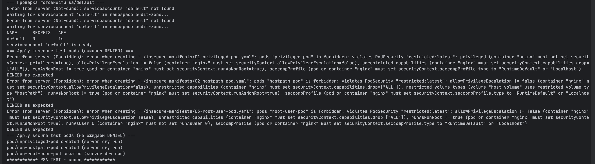
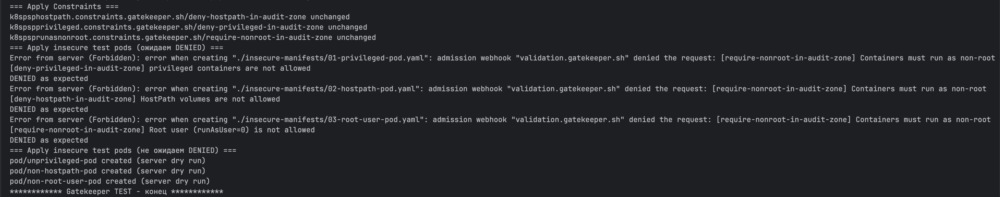

## Аудит и обеспечение соответствия политике безопасности контейнеров (PSP / PodSecurity / OPA Gatekeeper)

### Общий порядок действий
1. Сначала настраиваем namespace `audit-zone` c PSA политиками, ограничивающими создание небезопасных подов. 
   - проверяем, что небезопасные блокируюится PSA, а нормальные — нет;
2. Затем создаем namespace `audit-zone` без PSA политикам, ограничивающими создание небезопасных подов. 
   - проверяем, что небезопасные блокируюится PSA, а нормальные — нет;
   - можно было бы PSA не выключать, но тогда сходу не видно, что срабатывает Gatekeeper; возможно вебхуки срабатывают под капотом, но это не точно;
   - чтобы был более точный пример, нужно добавлять 4 правило в Gatekeeper — тогда поды, удовлетворяющие PSA будут блокироваться Gatekeeper;
   - но я просто рассмотрел Gatekeeper отдельно от PSA;

### Проверка механизм PSA
1. Запустить скрипт `chmod +x ./verify/1_PSA_apply_all_manifests.sh && ./verify/1_PSA_apply_insecure_manifests.sh`, где внутри:
   - delete/start minikube;
   - создание `ns audit-zone` с уровнем `PodSecurity restricted`;
   - попытка создания insecure подов, которые не пройдут аудит (д.б. DENIED), где:
     - 01-privileged-pod.yaml — включает `privileged: true`.
     - 02-hostpath-pod.yaml — монтирует cо свойством `hostPath`, то есть с монтированием в под пути из ноды kubernetes;
     - 03-root-user-pod.yaml — создается с `root (UID 0)`.
   - создание secure подов, которые пройдут аудит (не д.б. DENIED), где:
      - delete/start minikube;
      - создание `ns audit-zone` с уровнем `PodSecurity restricted`;
      - попытка применить манифесты с нарушениями (не д.б. FAILED):
          - 04-privileged-pod.yaml — включает `privileged: false`.
          - 05-non-hostpath-pod.yaml — монтирует с volume, но без свойства `hostPath`;
          - 06-non-root-user-pod.yaml — создается со свойством `runAsNonRoot: true`.
2. Проверка работы PSA видна в момент блокировки создания insecure подов c ошибками вида ` pods "root-user-pod" is forbidden: violates PodSecurity "restricted:latest"`.

     
### Проверка OPA Gatekeeper
1. Запустить скрипт `chmod +x ./verify/2_Gatekeeper_apply_all_manifests.sh && ./verify/2_Gatekeeper_apply_all_manifests.sh`, где внутри:
   - delete/start minikube;
   - создание `ns audit-zone` без labels (бeз PSA);
   - скачивание и установка `open-policy-agent/gatekeeper`;
   - проверки, когда поднимутся поды gatekeeper;
   - применение конфигов `gatekeeper`: подготовленных файлов [constraint-templates](gatekeeper/constraint-templates) и [constraints](gatekeeper/constraints);
   - попытка создания теж же `insecure` подов, которые не пройдут аудит (д.б. DENIED);
   - создание тех же `secure` подов, которые пройдут аудит (не д.б. DENIED);
2. Проверка работы Gatekeeper видна в момент блокировки создания insecure подов с ошибками вида `admission webhook "validation.gatekeeper.sh" denied the request`;
